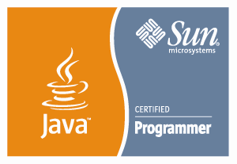
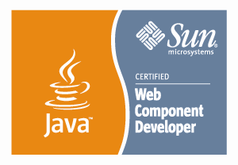
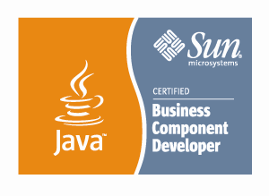

Paramsivam K                                                

---

##### 91 9940651567 - paramjobseek@gmail.com #####

* He has 12 years of experience in IT, worked in Java and its various
  frameworks/library
* He worked for 5 years at **TCS**, 5 years at **Mahindra Satyam** and 2
  years at **iGATE**
* He has exposure in Banking, Oil and Gas, Logistic and Media domain.
* He worked for GE-NBC, Ford, Nissan, Standard & Poor's , Citi, Citco Bank, Verizon
* He completed, **B.E** in **Computer Science Engineering** at 2003, in
  Bharathidasan University
* He played many role and responsibility like selection of technologies, Developer,  Designer and Tester
* He has habit of keep on updating for new technologies/version.
* He made himself familiar with NodeJS, various javaScript UI frameworks
  and android programming
* He eager to work in different JavaScript frameworks for both UI and
  Server-side programming
* His own documents/articles/quick-reference for many technology can
  find at [My Tech Book](https://paramothers.gitbooks.io/mybook/content/)

****
### Objective

Want to use obtained expertise JavaScript technologies for Desktop, Mobile and Web applications.

### Technology Experience and Exposure

|  JavaScript Technologies |  Java Technologies  |     
| ------------------    | ------------------- |
| **Runtime**: Node JS 4.0|  |
| **CSS**:  CSS 3, BootStrap 3.0, SASS, [Less]| **Spring 4.2 Modules**: MVC, RestFul, Message, Security, AOP, Batch, Data, Remote, Cache, Portlet|
| **UI frameworks**:  Angular JS 1.4,[ExtJS 4, JQuery] | **Persistence**: JDBC 1.4, MyBatis 3.1, MBG 1.8, JPA 2.0, Hibernate 4.0, SQL-99, PL/SQL  |
| **Hybrid-Mobile**: Cordova 4, Ionic| **Build Tool**: Gradle 2.4, Maven 3.1, Ant 1.6 |
| **Domain-Object**: JSON, CSON| **JEE Technology**: Servlet 3.1, JSP 1.2, JMS 1.1, JavaConfig, Java Validation |
| **Dependency-Resolve**: NPM, Bower, [Broserify]| **Web Service and XML**: XML Schema 1.1, JAXP 1.4, JAXB 2.0 & Jibx 1.2, SOAP 1.1 & SAAJ 1.2, JAX-RPC 1.1, JAX-WS 2.0, XStream   1.2|
| **Linting**: ESLint, [JSHint, JSCS]| **Desktop Frameworks**: SWT 3.0, JFace,  Swing 1.5, AWT |
| **Workflow**: Gulp, [Grunt] | **Web & App Servers**: Jetty 1.9, Tomcate 7.0, WebSphere 7.0, jBOSS 4,Weblogic 9.2   |
| **Test**: Jasmine 2.4, Protractor 3.2, Karma   0.13| **Library**: Struts 2.1, POI, iText 2.6, jUnit 4.12, Mockito |
| **VCS**: Git, GitHub, SVN, ClearCase | **Design**: OOAD, UML 2.0, Design Pattern, Design Thumb Rule |
| **IDE**: Atom 1.5, Eclipse 4.3 Mars, Intellij IDEA 16, NetBeans 8, Sublime Text 3| **DB**: Oracle 12, Sybase ASE 15, H2 1.2, HSQLDB  2.0 |
| **Cloud IDE**:  c9.io, coding.io, Codenvy3| **Others**: gitbook, kamihq, Markdown, Xodo |

### Java Certification

* SCJP 1.5, Sun Certified Java Programmer (90%)
* SCWCD 1.4, Sun Certified Web Component Developer (85%)
* SCBCD 1.3 Sun Certified Business Component Developer ( 85%)

### Played Roles and Responsibility

* Developer
* Tester as writing Unit/Integration 
* Design & analysis
* orchestration of appropriate frameworks/technologies
* Tech Lead

### Project Titles and Client Details

####12. Loan Loss Reserve 

it comes under credit risk, to help the customer how much amount has to be reserved in terms of million based on 35 different calculation applied on about 2 million transaction across globe. We calculate many loan equivalence amounts, Risk Capital amounts. Basically it is batch application consist of 35 different tasks. We have a web front end application, through which, user can upload data for every month and can do some adjustment on calculated amounts.

####11. NextGen

CITCO provides the Custodial and Brokerage services. NextGen, which is the bank of Citco is responsible for taking and executing Trade for different Assets. It also keeps track for the Companies which is holding their corresponding assets. There are many external system of CITCO like Fund Administrator, Equation, CDS, CORONA, etc. with which NextGen is interacting

####10. Russian Plant

MRP Lite project is to provide a facility to receive Individual Parts delivered from a number of suppliers and store them in a warehouse external to the plant. It is also the aim of this project to provide a facility to Kit these individual parts into groups of parts called Local Kit cases ready for delivery to the Warehouse at the plant.

####9. Volume Services

It is rating providing application. S&P provide rating for different companies and different domains based on different criteria. This volume service developed to provide rating for stock exchange like NSE.

####8. Enterprise Information Search Platform (EISP)

It is like Google Search. Once feed user data in to search engine, it can be searched and searched result grouped logically, result can be ranked logically. This application built on top of FAST Search Engine. User send search request to engine by a web service interface. 

####7. Port Vehicle Operating System (PVOS)

  it was a logistic application for Jaguar and Land Rover vechile. It has facility to handle and track all the activities from Port to Customer Delivery process
  
####6. Video Scheduling System (VSS)

A web based application, in which watch the movie clips, listen the mp3 clips using media player plug-in but with customized player controls and rate the clips. In admin, manage the clips in category and sub-category, secure some of clips only for authenticated user, and upload the clips, managing some outside media link as reference to CSBD, SNBC 

####5. Demand Based Clustering System (DBCS)

A statistical engine that allows the use of sales data and consumer demographic data to improve product assortment on retail shelves for DVDs. It uses the K-Means Clustering to make distinctions

####4. International Picture Casting (IPC) 

International Pictures Casting, which makes selection of voice talents in different languages for a film to be web enabled. Adding role to a film, adding real actor role, add voice talent to a particular role, upload their voice clip and resume.  In admin, add films to the application, associate user to film access, approve the voice talent

####3.Business Affairs Summaries and Information System(BASIS) 

The current system is a VB / Sybase system which has five different modules to help business affairs admin and negotiators on the contract negotiations for NBCU Project, The project will develop the BARMS system as a single integrated application in J2EE based web information system. The system will also integrate Business Affairs and Negotiators for cable channels

####2. Pay Per view – video on Demand (PPV-VOD)

A multi-year agreement with the customer that obligates them to license the rights to particular categories of titles. As user login title selection, adding notes, update the status of deals of titles, maintain own deals and advanced search. Admin user can add team, maintaining team’s user and deals, auto-notification

####1. 

### Declaration

Hereby, I declare that all the above-furnished information is true to the
best of my knowledge. I look forward to joining your Firm/Project where
I can further my career and put to the best of use my experience,
knowledge and communication skills.

                                                    K.PARAMASIVAM.
                                                    
                                                  
###### Generated using Markdown

